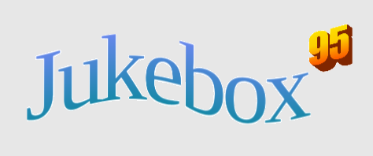
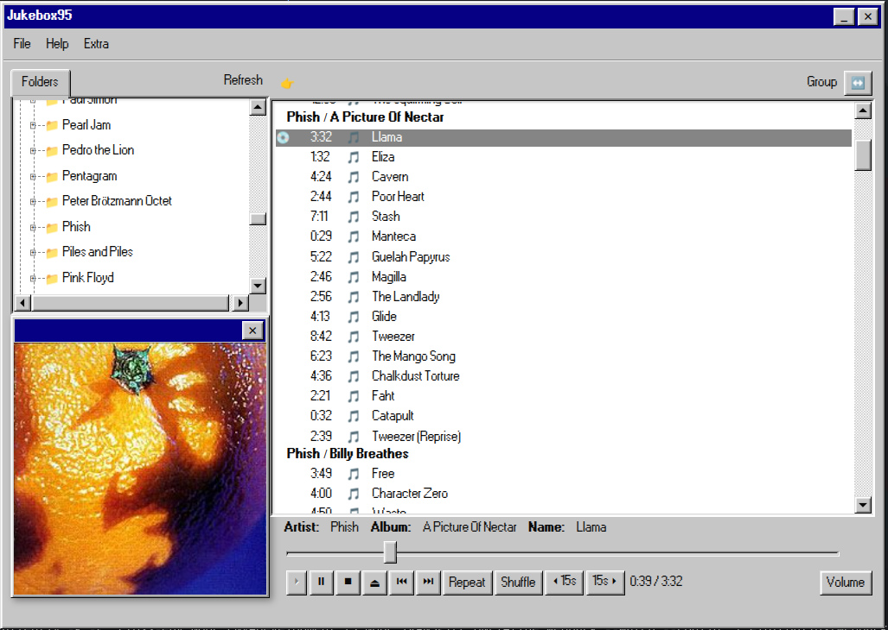
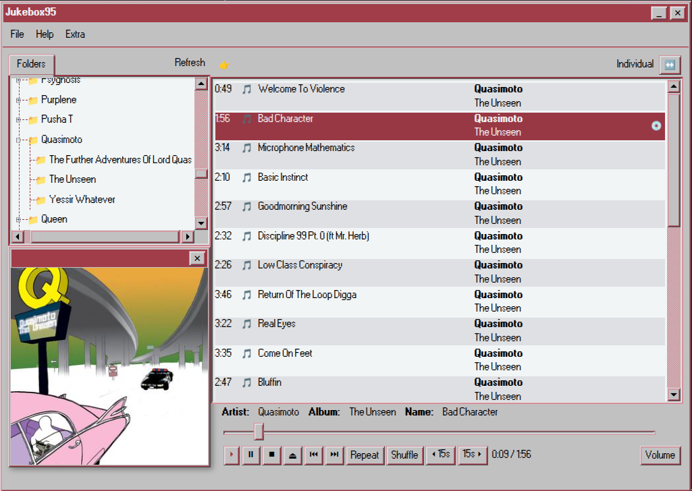
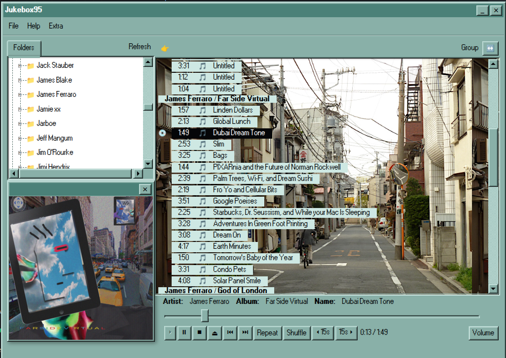
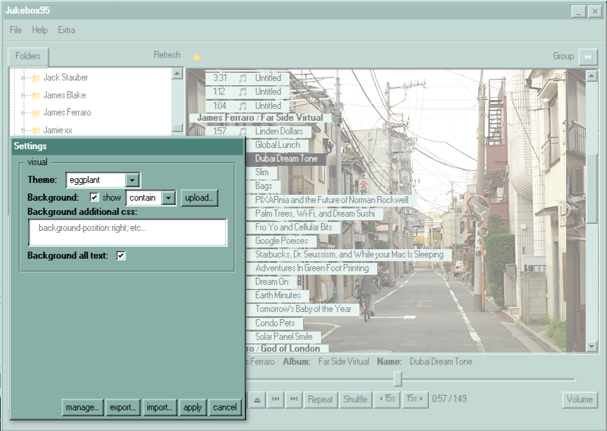
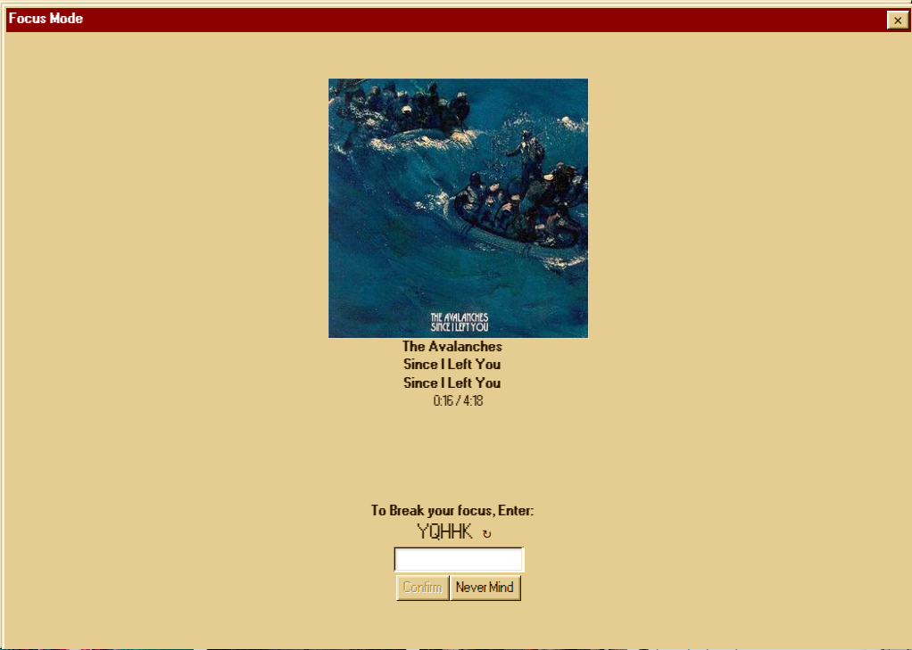

## What

A music player with support for the Subsonic API as well as local files written in stylish React95.

## Development

Runs from ./src -- npm install && npm run start

## Install

Releases are up for Linux and Windows. Mac users can clone this repository and build it themselves.

## Screens

